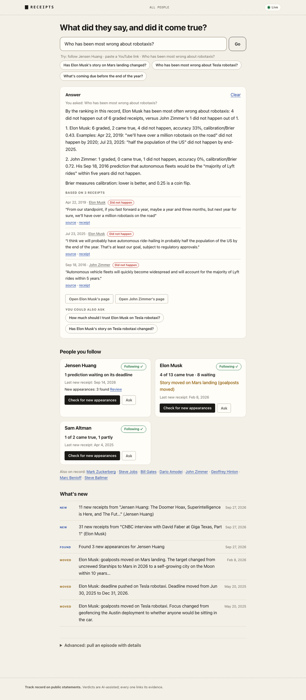
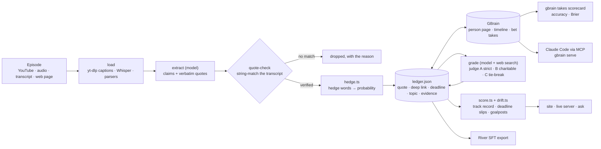

# Receipts

**Intelligence you own: every episode you feed it makes your judgment sharper.**


Public figures make a lot of confident predictions on podcasts and in interviews, and almost nobody checks them when the date comes around. Receipts does the checking. Feed it an episode (a YouTube link, an audio file or a transcript) and it pulls out every checkable claim the guest made, keeps the exact words with a link to the timestamp, and throws away any quote it can't find in the transcript (word for word, or with at most a small transcription slip that changes no number and no negation). It turns hedge words ("for sure", "I think", "maybe") into probabilities, grades each prediction against web evidence once its deadline passes, and tracks how a person's story moves over time (Mars 2018 → 2022 → 2026 → "a self-growing city on the Moon"). The results live in your own [GBrain](https://github.com/garrytan/gbrain), on each person's page, as bet takes that GBrain's own `takes scorecard` can score. You can then ask "how much should I trust Elon Musk on robotaxi timelines?" and get an answer backed by dated quotes.

Built for the YC **Own Your Intelligence** hackathon.


<details><summary>Asking a question in plain words</summary>



</details>

Full third-party transcripts are not included in this repository. Receipts fetches them when you pull an episode, and keeps only short verbatim quotes with links back to the source.

## Quick start

```bash
receipts start            # checks the setup and opens http://127.0.0.1:4321 (add --offline to replay recordings, no key needed)
```

Then type into the one box:

- **A name**, like `Jensen Huang`: it follows him and searches the web for his recent podcasts, interviews and talks (1 to 2 minutes live). Press **Pull receipts** on one: it reads the first 20 minutes, keeps only quotes it finds word for word, and grades anything whose deadline has passed.
- **A link**: it pulls receipts from that video or transcript page.
- **A question**, in your own words: `Has Jensen changed his tune on AGI?`, `Who has been most wrong about robotaxis?`, `What's coming due before the end of the year?`. The answer cites dated quotes with links.

Cards show each person's record in plain words ("4 of 13 came true · 8 waiting", "Story moved on Mars landing"). "Calibration" is the Brier score: lower is better, 0.25 is a coin flip. Setup from zero is below.

## Why it fits "Own Your Intelligence"

- **The memory is yours.** People, timeline entries and bets go into your own GBrain through the `gbrain` CLI: `people/<slug>` pages, `timeline-add` entries and `takes add --kind bet` rows. GBrain is the system of record, and `gbrain takes scorecard people/elon-musk` gives the same accuracy and Brier score as Receipts. Nothing is kept on a hosted service.
- **The skills are markdown.** `skills/receipts-{ingest,grade,drift,ask}/SKILL.md` is a GBrain skill pack (`gbrain skillpack doctor` scores it 10/10). Any agent that can read your brain can follow the skills, with or without the engine.
- **It compounds.** Each new episode adds to existing drift chains, because topic keys are reused across episodes. Each deadline that passes turns an open bet into a graded one. The track records get better the more you feed in.
- **You can train your own grader.** `receipts export --river` writes every graded claim, with its evidence and verdict, as chat-format JSONL. You can fine-tune a small open model on River and grade with your own model instead of a rented one.
- **Code does the deterministic work; the model does the judgment.** Probabilities, Brier score, lateness and deadline slips are plain functions. The model extracts claims, judges verdicts, labels goalpost moves and writes answers. It never chooses the numbers.

## How it works



- **Ledger** (`data/ledger.json`): the full record for each claim, holding the fields a GBrain take row has no column for (quote, deep link, deadline, topic, drift, evidence list).
- **GBrain**: one `people/<slug>` page per person. It holds a timeline entry per quote, a take per claim (predictions become `bet`, stances `take`, facts `fact`), a resolution per graded prediction, and a Track Record block between `<!-- receipts:track-record:begin/end -->` markers. Sync is idempotent.
- **Grading**: two judges search the web. Judge A reads the claim's wording strictly and judge B reads the speaker's intent charitably. If they disagree, judge C breaks the tie. The speaker's own later claims of success don't count as evidence. A deadline still in the future gets `too_early` with no model call.

## Setup on a Mac, from zero

You need Bun, GBrain, yt-dlp and, for live runs only, an OpenAI key. The offline demo needs no key. About 10 minutes.

```bash
# 1. Bun (the runtime for both GBrain and Receipts)
curl -fsSL https://bun.sh/install | bash        # then open a new terminal

# 2. GBrain, from GitHub (the npm package called "gbrain" is unrelated)
bun install -g github:garrytan/gbrain
gbrain --version                                # 0.59.0 or later

# 3. A brain just for Receipts, so the demo's 11 people never land in your personal brain
mkdir -p ~/receipts-brain
export GBRAIN_HOME=~/receipts-brain             # for raw gbrain commands in this terminal
gbrain init --pglite --no-embedding             # local brain, no server, a few seconds
#    Skip the "Do this next: claude mcp add gbrain -- gbrain serve ..." hint that init prints.
#    While a `gbrain serve` has this brain open, Receipts' GBrain sync fails ("pglite_busy").
#    The Claude Code step is the last beat of the demo, with its own server.

# 4. yt-dlp, for YouTube captions
brew install yt-dlp

# 5. Receipts
tar -xzf receipts.tar.gz && cd receipts         # the copy you were given
#    (once the repo is public: git clone https://github.com/DhyeyMavani2003/receipts && cd receipts)
bun install
bun link                                        # puts `receipts` on your PATH
                                                # (or: alias receipts="bun $PWD/src/cli.ts")
cp .env.example .env                            # then paste your key after OPENAI_API_KEY= yourself
echo "GBRAIN_HOME=$HOME/receipts-brain" >> .env # Receipts always uses the demo brain, from any folder
receipts doctor                                 # every check "ok", then "Ready."
```

`receipts doctor` warns that the ledger does not exist until the first `seed` or `demo`; that is expected. Without a key it fails the model check: add the key, or use `--offline` everywhere (the demo below works that way).

**Which brain gets written.** Receipts reads `GBRAIN_HOME` from your shell or from the repo's `.env` (the shell wins) and passes it to every gbrain call, which it runs from the temp folder. Raw `gbrain` commands are different: gbrain ignores `GBRAIN_HOME` when a `.env` in the folder you run it from assigns it, even if your shell exports it, and silently falls back to your default `~/.gbrain`. So with the line above in `.env`, run raw `gbrain` from outside the repo folder (`cd ~` first), with `export GBRAIN_HOME=~/receipts-brain` in that terminal. `receipts doctor` shows which brain Receipts uses, and every `receipts` command works from any folder.

`.env` settings (see `.env.example`):

| Variable | Meaning |
| --- | --- |
| `OPENAI_API_KEY` | Needed for live extraction, grading, drift labels and answers. Never printed: `doctor` only says `set` or `missing`. |
| `RECEIPTS_MODEL`, `RECEIPTS_GRADER_MODEL` | Optional model pins. Without them Receipts uses the first of gpt-5.5, gpt-5.2, gpt-5.1, gpt-5 and gpt-4.1 that your key can access. |
| `RECEIPTS_LLM` | `openai` (default) or `replay` (offline: every model call is answered from `fixtures/llm`). `--offline` does the same. |
| `RECEIPTS_RECORD` | `1` records every live model call into `fixtures/llm` for later offline replay. An existing discovery recording is kept (web search results change run to run); `force` replaces it. Offline, a recorded answer still replays after later pulls change its prompt, as long as every receipt it cites is still in the ledger. For the demo, finish all pulls first, then ask the stage questions live as the last step. |
| `RECEIPTS_TODAY` | Treats a given date as today (`--today` does the same). Grading fixtures depend on it. |
| `GBRAIN_HOME` | The brain Receipts writes to (a folder; gbrain keeps its data in `.gbrain` inside it). Use an absolute path in `.env`: `~` is not expanded there. Unset means gbrain's default brain. |
| `GBRAIN_BIN` | The gbrain executable, when it is not `gbrain` on your PATH. |

The `receipts` command reads the repo's `.env` from any directory. Variables already set in your shell take precedence.

## Commands

Every command accepts `--ledger <path>`, `--offline`, `--today YYYY-MM-DD` and `--no-color`, and `receipts <command> --help` shows its own options. If GBrain is missing, commands warn and carry on with the ledger. The exception is `sync`, which exists only to write to GBrain.

| Command | What it does |
| --- | --- |
| `receipts doctor` | Checks that the key is set (never prints it), that OpenAI is reachable and which model it will use, plus the gbrain version, yt-dlp and ledger stats. Exits 0 when the engine can run. |
| `receipts seed [--file F] [--no-gbrain]` | Loads the 32 curated seed claims (31 predictions, 11 people, each with a linked source) into the ledger and GBrain. |
| `receipts ingest <file\|url> --speaker "Name" [--host "Name"] [--title T] [--date YYYY-MM-DD] [--url U] [--kind podcast] [--dry-run] [--no-gbrain] [--no-grade]` | Runs one episode through load, extract and quote-check, then saves it, grades any predictions already past their deadline, labels drift and syncs GBrain. Always pass `--host` for interviews, so the host's questions are never attributed to the guest. A local file needs `--url`, its public link, because every receipt links its source. A YouTube URL fetches captions with yt-dlp; YouTube rate-limits bursts (HTTP 429), so for anything that matters save the captions first (see below) and ingest the `.vtt`. `--kind` labels the source on cards (`podcast` by default; `interview`, `keynote`, `earnings_call`, ...). |
| `receipts grade [--person slug] [--limit N] [--judges 1\|2\|3] [--regrade] [--no-gbrain]` | Grades predictions whose deadline has passed. `--regrade` re-judges model verdicts but never replaces curated seed verdicts. |
| `receipts drift [--person slug] [--no-llm] [--relabel] [--no-gbrain]` | Labels how each story moved: `pushed_later`/`pulled_earlier` come from code, and `goalposts_moved`/`reversed`/`escalated`/`softened` come from the model. The seed's curated labels are kept (seed-only chains are read from `fixtures/llm`, with no model call); `--relabel` lets the model redo them. |
| `receipts score [--person slug [--vs-gbrain]] [--json]` | Shows track records: accuracy, Brier score (0.25 is a coin flip), lateness, drift events, per-topic results and calibration. `--vs-gbrain` prints one line each for Receipts and GBrain's own `takes scorecard`, to 3 decimals. |
| `receipts sync [--person slug] [--rebuild]` | Pushes the ledger into GBrain. Idempotent, and it refreshes every Track Record block. A claim gbrain rejects is reported and the rest still sync; a retry writes only what is missing. `--rebuild` writes the ledger into a new or different brain from scratch (takes already there are matched, not added twice); a sync that finds a person's page missing does this for that person on its own. |
| `receipts site [--out out/site]` | Writes the static site: a leaderboard plus one page per person. |
| `receipts start [--port 4321] [--no-open] [--offline] [--today D]` | The easy way in. Prints a four-line check (model, YouTube captions, GBrain, ledger), records live model answers to `fixtures/llm` so the same demo replays offline (only when `RECEIPTS_RECORD` is not set; `.env.example` sets it to `0`, so delete that line or run `RECEIPTS_RECORD=1 receipts start` to record), tries the next 9 ports if 4321 is busy, and opens the dashboard in your browser. |
| `receipts serve [--port 4321]` | Runs the live site on 127.0.0.1, with the "Ingest an episode" form (receipts stream in over SSE) and the ask box. |
| `receipts ask "question" [--json]` | Answers "How much should I trust X on Y?" with receipts. Offline, or without a fixture for that question, it answers from a template. |
| `receipts follow "<name>" [--discover]` | Follows a person (saved in `data/watchlist.json`, next to the ledger). `--discover` then looks for their recent appearances. |
| `receipts unfollow "<name or slug>"` | Stops following them. Their receipts and past finds stay. |
| `receipts discover ["<name>"] [--limit N] [--since YYYY-MM-DD] [--pull N] [--max-minutes M] [--no-gbrain]` | One web search for the person's recent long-form appearances (podcasts, interviews, keynotes, earnings calls; default: the last 180 days, 5 results). Every link is checked: public, inside the window, not a short clip, found by the search, not a duplicate, not already in your receipts. Results are saved in `data/discoveries.json`. No name checks everyone you follow. `--pull N` pulls receipts from the top N, and `--max-minutes 20` reads only the first 20 minutes of each (a quick pull). A pull waits 20 s between YouTube requests, falls back to a built-in captions reader when yt-dlp is rate-limited (HTTP 429) or missing, and caches the full transcript in `data/cache/transcripts`, so a later pull of the same video needs no download. With `RECEIPTS_RECORD=1` the search is recorded, so `--offline` replays it for the same name and `--today`. |
| `receipts watch [--pull N] [--every 24h] [--max-minutes M] [--no-gbrain]` | Runs discovery for everyone you follow who has not been checked within `--every` (default 24h, at least 1h; at most 10 people and 3 pulls each per run). Without `--every` it runs once; with it, it keeps checking until Ctrl-C. |
| `receipts export [--river [out/river-sft.jsonl]]` | Writes a River SFT export (to `out/river-sft.jsonl` unless you give a path) with one chat per graded claim: brief, claim plus evidence, and the verdict as JSON. |
| `receipts demo [--live <url\|file> --speaker "Name" ...] [--out out/site] [--no-gbrain]` | Runs seed, then the optional live episode, then drift, GBrain sync and the site, and prints the leaderboard. |

## The dashboard

`receipts start` opens one calm page at `http://127.0.0.1:4321` with one box. Type anything:

- a name (`Jensen Huang`, or `follow Jensen Huang`): Receipts follows them and searches the web for their recent long-form interviews, podcasts and talks, narrating as it goes. Each find has a **Pull receipts** button (first 20 minutes, or `pull the whole thing`).
- a link: it pulls receipts from it. If it cannot tell whose words to pull, it asks.
- a question in plain words (`Has Jensen changed his tune on China?`, `Who has been most wrong about robotaxis?`, `What's coming due next month?`): the answer cites dated receipts, each linked to where it was said.

Below the box: cards for the people you follow ("2 of 11 came true · 3 waiting", with **Check for new appearances**) and a short "What's new" feed (new receipts, deadlines that passed or are coming up, stories that moved). The badge in the corner says where answers come from: **Live**, **Offline replay** (`--offline`, recordings only) or **Offline: no API key**. If the network fails mid-demo, a live answer falls back to its recording and says so. The old page with the leaderboard and the detailed ingest form is at `/classic`; the ingest form is also under **Advanced** on the dashboard. Pages need no network to render (system fonts, no CDN).

## The 3-minute demo

Everything here runs offline from recorded answers, so it needs no key and no network (the site loads its fonts from Google Fonts once; without network it falls back to system fonts). Keep one terminal in the repo folder for `receipts` and, for the raw `gbrain` beat, a second one outside it (see "Which brain gets written" above).

**Before you go on stage (at least 15 minutes ahead):**

```bash
cd ~/receipts                                  # the repo folder; the form's relative paths resolve from here
receipts demo --offline                        # seed → drift → GBrain sync → site, about 2 min the first time
                                               # (each of ~120 GBrain writes is its own gbrain process; reruns are faster)
# optional: record a live episode now, see "Record a real episode for the stage" below
cp data/ledger.json data/ledger.stage.json     # the clean stage ledger; rehearsals below change data/ledger.json
receipts serve --offline --today 2026-09-27    # then open http://127.0.0.1:4321 (the leaderboard is at /#leaderboard)
```

What you get at http://127.0.0.1:4321: the leaderboard of the 11 seeded people, one page per person at `/p/<slug>` (for example `/p/elon-musk`: stat tiles, drift chains, every receipt with its quote and source link), the "Ingest an episode" form, and the ask box with starter questions. `receipts site` writes the same pages as static files to `out/site/` if you want them without a server.

Rehearse the stage steps once, then put the stage state back: stop the server (Ctrl-C), `cp data/ledger.stage.json data/ledger.json`, and start `receipts serve --offline --today 2026-09-27` again. A rehearsed ingest otherwise stays on the leaderboard (the fictional "Dana Founder" of the synthetic interview lands at #2). Its GBrain rows stay in the demo brain either way; to keep the brain clean, rehearse the synthetic interview with `--no-gbrain` in the terminal instead of the form.

Don't start Claude Code's gbrain server before the last beat, and don't re-run `demo` or `drift` between recording an episode and the stage: the recorded answers depend on the ledger staying the same.

**On stage:**

| Time | Do | Say |
| --- | --- | --- |
| 0:00 | Show the leaderboard at `http://127.0.0.1:4321/#leaderboard` (zoom the browser to 150% for a projector; on a 1280-wide projector don't go past 150%, or the last column scrolls off). | "Every row is a real person's dated, verbatim predictions, graded against evidence. Elon Musk: 13 predictions, 2 correct and 9 incorrect so far, Brier 0.48. A coin flip scores 0.25." |
| 0:20 | Click **Elon Musk** and scroll to the drift chains. | "Mars in 2018, then 2022, then 2026, and then 'a self-growing city on the Moon'. Code measures the deadline slips; judgment only labels the goalposts moving." (The seed's judgment labels are curated, not model output, and their chips say "curated label".) "Every card has the exact quote and a link to the source." |
| 0:50 | Open the prefilled form link for a recorded episode and press **Ingest episode**. The repo ships one: CNBC's 2025-05-20 Elon Musk interview (`fixtures/transcripts/6hz9Bqnfi-I.en.vtt`, recorded with `--today 2026-09-27` against the ledger `demo --offline` builds), at `http://127.0.0.1:4321/?input=fixtures%2Ftranscripts%2F6hz9Bqnfi-I.en.vtt&speaker=Elon+Musk&host=David+Faber&title=CNBC+interview+with+David+Faber+at+Giga+Texas%2C+Part+1&date=2025-05-20&url=https%3A%2F%2Fwww.youtube.com%2Fwatch%3Fv%3D6hz9Bqnfi-I#ingest` (31 verified, 2 dropped, 2 graded CORRECT). For your own recording, use the same link shape with your values. | "Here's an episode it has never seen." The log says it is replaying recorded model answers, so the receipts arrive within seconds. "A claim is dropped when its quote isn't in the transcript or the quote doesn't support it, and the log says why. Anything past its deadline is graded right now, with evidence links." If a field differs from the recording, the error names it. |
| 1:50 | In the ask box, paste `How much should I trust Elon Musk on robotaxi timelines?` (once it is recorded, the first starter button asks exactly this). | "It answers only from receipts, cites them by date and quote, and says how thin the record is." |
| 2:20 | In the terminal: `receipts score --person elon-musk --vs-gbrain`. For the raw card, in the second terminal outside the repo folder: `gbrain takes scorecard people/elon-musk --json`. | "Same accuracy and Brier, one line each. This all lives in my own GBrain, not in this app." |
| 2:35 | `receipts export --river out/river-sft.jsonl` | "Every graded claim becomes training data, so I can fine-tune my own grader on River. Intelligence you own." |
| 2:50 | Last: start Claude Code with its own gbrain server pinned to the demo brain (set up once, below) and ask: "Use my brain: what's Elon Musk's track record on robotaxi timelines?" | "Any agent I use can now read the track record." |

**The Claude Code beat comes last.** `gbrain serve` (which Claude Code starts for the MCP server) holds the PGLite brain open, and while it runs every other gbrain process on that brain fails with `pglite_busy`: the ingest form's GBrain sync, `receipts sync`, `score --vs-gbrain` and raw `gbrain` commands. `receipts export` and the site keep working. Set it up once, from an empty folder outside the repo (a `.env` that assigns `GBRAIN_HOME` in the folder Claude Code starts in would send gbrain to your default brain):

```bash
mkdir -p ~/receipts-mcp && cd ~/receipts-mcp
claude mcp add receipts-brain -e GBRAIN_HOME=$HOME/receipts-brain -- gbrain serve
# on stage, at 2:50 only (the last beat):
cd ~/receipts-mcp && claude
```

Quit Claude Code when the beat is over, before any other `receipts` or `gbrain` command. If you'd rather not risk it, skip the beat: `receipts score --person elon-musk --vs-gbrain` already shows GBrain's own numbers.

Terminal-only version of the same demo:

```bash
receipts demo --offline
receipts ingest ./fixtures/transcripts/<episode>.en.vtt --speaker "Name" --host "Host" \
  --title "..." --date YYYY-MM-DD --url "https://www.youtube.com/watch?v=..." --offline --today 2026-09-27
receipts ask "How much should I trust Elon Musk on robotaxi timelines?" --offline --today 2026-09-27
receipts score --person elon-musk --vs-gbrain
```

For a test ingest that involves no real person, `receipts ingest fixtures/transcripts/synthetic-interview.txt --speaker "Dana Founder" --host "Sam Host" --title "Synthetic Interview (test fixture)" --date 2025-01-15 --url https://example.com/synthetic-interview --offline --no-grade --no-gbrain` works offline (no grading fixtures ship for it, so `--no-grade`). It is an invented interview, labelled as such in the file, and it adds the fictional Dana Founder to the ledger, so restore `data/ledger.stage.json` afterwards. In the web form the same episode is one click: `http://127.0.0.1:4321/?input=fixtures/transcripts/synthetic-interview.txt&speaker=Dana+Founder&host=Sam+Host&title=Synthetic+Interview+(test+fixture)&date=2025-01-15&url=https://example.com/synthetic-interview#ingest`. Offline, the form says in one line that its due predictions were not graded (there is no recorded grading for them), and it also writes `people/dana-founder` into the demo brain.

## Record a real episode for the stage

Replay fixtures are keyed by the exact prompt. That covers the transcript text, speaker, host, title, link, date, the speaker's existing topic keys in the ledger, `today` (for grading) and the question text (for ask). So record with the same ledger, flags and date you will use on stage, then put the ledger back. Recording needs the key and costs a few dollars at most: an extraction call or two per episode, two judges with web search per due prediction, one call per drift chain the episode joins, and one per ask.

```bash
# 0. Pick a short episode (10-20 min) with someone already in the seed (Elon Musk, Jensen Huang, ...),
#    so new claims join existing drift chains (tesla-robotaxi, mars-landing, ...).
#    Pick one at least a year old with dated forecasts ("next quarter", "by the end of next year"):
#    a recent episode can give no prediction that is due yet, and then nothing gets graded on stage.
#    A proven example: Jensen Huang's segment (13:35-26:59) of Bloomberg's 2024-08-28 special,
#    https://www.youtube.com/watch?v=pcuwZ8zk2ng, gave 5 due predictions, all graded with SEC/IR evidence.
receipts demo --offline                         # the ledger state you will have on stage
cp data/ledger.json data/ledger.before-episode.json

# 1. Save the captions to a file, so the stage run needs no network at all. yt-dlp also writes
#    .en-en.vtt / .en-orig.vtt variants; use VIDEO_ID.en.vtt. If YouTube answers HTTP 429,
#    wait a few minutes: it rate-limits bursts. Don't paste a live YouTube URL on stage.
yt-dlp --skip-download --write-subs --write-auto-subs --sub-langs "en.*,en" --sub-format vtt \
  -o "fixtures/transcripts/%(id)s" "https://www.youtube.com/watch?v=VIDEO_ID"

# 2. Record: real model calls, written to fixtures/llm as they succeed.
RECEIPTS_RECORD=1 receipts ingest fixtures/transcripts/VIDEO_ID.en.vtt \
  --speaker "Elon Musk" --host "Host Name" --title "Episode title" --date YYYY-MM-DD \
  --url "https://www.youtube.com/watch?v=VIDEO_ID" --today 2026-09-27
RECEIPTS_RECORD=1 receipts ask "How much should I trust Elon Musk on robotaxi timelines?" --today 2026-09-27
# The ask box's starter chips offer this exact question, so a click replays it.
# Save the prefilled form link for the stage (see 0:50 above) with these same values.

# 3. Put the ledger back so the stage ingest shows receipts arriving.
#    GBrain already has the rows; the stage sync finds them and adds nothing twice.
cp data/ledger.before-episode.json data/ledger.json
cp data/ledger.json data/ledger.stage.json

# 4. Rehearse exactly what you will do on stage, fully offline, then run step 3 again
#    so the episode is new once more when you ingest it on stage.
receipts serve --offline --today 2026-09-27
```

Record with your own episode's values, not the synthetic interview's. A live answer never replaces a curated fixture (the synthetic interview and the seed's drift labels); recording one prints `Not recorded: ...` and leaves it as it is. Live drift never relabels the seed either: a chain made only of seed claims takes its curated labels from `fixtures/llm`, and a curated label stays when a new episode joins its chain (`receipts drift --relabel` lets the model redo them).

The fixture files hold the prompt's hash, the first 200 characters of the prompt and the validated answer. They never hold the key, headers or raw API bodies. If a stage call misses its fixture, the error names the missing file (never its full path) and the prompt field that differs from the closest recording, such as the host or date. Ask falls back to its template answer, which shows the oldest and newest receipts on the topic and how the story drifted. If the network and key work on the day, you can drop `--offline` and run everything live.

## Tests

```bash
bun test ./test                   # unit + integration, offline, ~3 s (plain `bun test test` also runs e2e/)
bunx tsc --noEmit -p .            # typecheck
bun run e2e                       # against the real gbrain CLI in a throwaway brain, ~3 min
scripts/demo-check.sh             # whole offline path in a temp dir + throwaway GBrain, PASS/FAIL per step (~3 min)
scripts/demo-check.sh --no-gbrain # same without GBrain, under 10 s
gbrain skillpack doctor . --quick # skill pack health (10/10)
```

`out/e2e-run.txt` is a full transcript of `scripts/demo-check.sh --verbose`.

Seed data tools:

```bash
bun scripts/build-seed.ts                 # data/seed/parts/*.json → data/seed/predictions.json (ids via claimId, validated)
bun scripts/validate-seed.ts              # checks fields, dates, 0.05 probability steps, verdict/grading agreement, evidence URLs, neutral wording
bun scripts/make-seed-drift-fixtures.ts   # offline drift labels for the seed chains (curated, model "human:seed-drift")
bun scripts/make-synthetic-fixtures.ts    # offline extraction fixtures for the synthetic interview
```

## Limitations and safety

- **Neutral by design.** It is a track record on public statements, never a finding that someone lied. Unresolvable is a legitimate verdict, and speaking about someone's claims is not the same as judging their character. Verdicts are AI-assisted except the seed rows, which were curated from public sources, each with a linked source, and spot-checked against those sources on 2026-09-27. Every verdict links its evidence. Some evidence sites (sec.gov, AP) block automated fetches, so open a link in a normal browser before relying on it on stage.
- **Quotes are string-matched, not trusted.** Extraction only keeps a quote found in the transcript: an exact match, or a near match (score of at least 0.85) where numbers and negations agree. Cards show the transcript's own words, so a near match reads exactly as the captions do, filler words aside; cards do not mark which quotes were near matches. Auto-captions can mishear words ("air researchers" for "AI researchers") and carry no speaker labels, so for interviews pass `--host` and spot-check the cards. A seed quote taken from reporting rather than a transcript is marked `quoteVerified: false`. One sentence can yield several claims that share its quote; each gets its own card, take and GBrain timeline entry ("claim 2 of 3 from this quote").
- **Hedge words are a simple table.** It does not handle negation ("not likely" scores 0.70) and misses phrasings that are not in the table. Nine seed rows have hand-set probabilities, which `validate-seed` lists as warnings.
- **Lateness counts predictions that came true late, whatever the verdict.** A late delivery is graded incorrect (the deadline passed first) with the day it happened in `resolvedOn`; Late × is the median of (actual time) / (promised time) over those, in days. Accuracy and Brier still count only correct and incorrect. Below 5 graded predictions the leaderboard greys the numbers out as a thin record.
- **GBrain resolutions are immutable.** Once a take is resolved, a later regrade changes the ledger but not GBrain, and Receipts warns when that happens. Each gbrain call is a separate process taking about a second, so the first sync of the seed takes about 2 minutes.
- **Secrets.** The key lives only in `.env`, which is gitignored. It is never printed, and key-shaped strings are removed from errors and fixtures. gbrain subprocesses inherit your environment, including `OPENAI_API_KEY`, which GBrain uses for embeddings. `scripts/demo-check.sh` blanks the key so the check makes no API calls.
- **The server has no authentication.** It binds to 127.0.0.1 and its ingest form reads local file paths, so don't expose it to a network. It answers only to `127.0.0.1`/`localhost` on its own port (no DNS rebinding), refuses API calls from other sites (Origin and Fetch Metadata checks; ingest must be `application/json`), and the form reads only transcript and audio files outside hidden folders.
- **Seed data** was checked on 2026-09-27. A few X posts could not be fetched directly and were confirmed through search results and post-ID dates. `Dana Founder`, `Sam Host` and `Ferrowind Robotics` in `fixtures/` are fictional.

## Layout

```
src/            engine (cli.ts, extract, quote-check, hedge, grade, drift, score, gbrain adapter, site, server, llm/)
skills/         GBrain skill pack: receipts-ingest, receipts-grade, receipts-drift, receipts-ask
data/seed/      predictions.json (built from parts/*.json)
fixtures/       transcripts/ (test inputs) and llm/ (replay fixtures)
scripts/        build-seed, validate-seed, fixture makers, demo-check.sh
test/  e2e/     unit/integration tests; tests against a real gbrain binary
```

## Credits

- [GBrain](https://github.com/garrytan/gbrain) by Garry Tan: the takes table, `takes resolve` and `takes scorecard`, the person template and the skill-pack format that Receipts builds on.
- OpenAI Responses API (structured outputs and web search) and Whisper, [yt-dlp](https://github.com/yt-dlp/yt-dlp), [Bun](https://bun.sh) and [zod](https://zod.dev).
- Extraction follows the Claimify approach to atomic, checkable claims (Metropolitansky and Larson, Microsoft Research, 2025). Scoring uses the Brier score (Brier, 1950), the same measure as GBrain's scorecard.
- Built by Dhyey Mavani, with Claude Code, for the YC Own Your Intelligence hackathon (GBrain, QM, River AI, Memorable, Superset, UFO).
